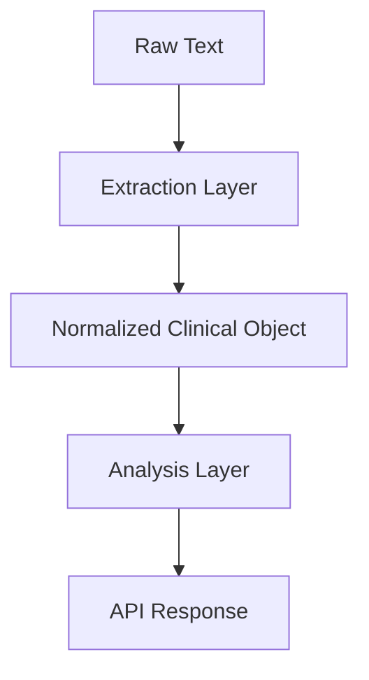

# reimagined-train


A backend system that takes unstructured medical/health text and converts it into structured, queryable clinical insights using LLMs + a lightweight reasoning pipeline.

## Overview
When reading clinical notes, professionals will often need to manually identify the relevant details such as symptoms, medications, and patient information from a long, often messy, summary. This project aims to assist medical practitioners to process this data, taking in raw clinical text and outputting an easily parseable JSON object. 


## Tech Stack
* Python
* FastAPI 
* Pydantic
* LLM *TBD*.

## API Documentation

### Base URL
All request must use the following base URL \
`https://example.com`

### Analyze raw text


* **Endpoint:** `/analyze`
* **Method:** `POST`
* **Content-Type:** `application/json`

| Parameter | Type | Description | Required |
| :--- | :--- | :--- | :--- |
| `text` | string | Raw clinical note content | Yes |

#### Example Request
```
curl -X 'POST' \
  'http://127.0.0.1:8000/analyze' \
  -H 'accept: application/json' \
  -H 'Content-Type: application/json' \
  -d '{
  "text": "string"
}'
```
#### Responses

##### 200 Successful
Returned when text input is parsed successfully


##### 422 Validation Error
Returned if text input does not meet the necessary fields

## Modules

### 1. Raw text
Clinical note written by doctor

### 2. Extraction Layer
Convert raw text into structured JSON info using LLM

### 3. Normalized Clinical Object
Standardize info for consistency.
e.g. head hurts, migraine --> Headache

### 4. Analysis Layer
Processes clinical info, extracting useful information

### 5. API Response
Package for API

## Current Status
In Development

## Safety Note
Safety note: not for diagnosis or treatment